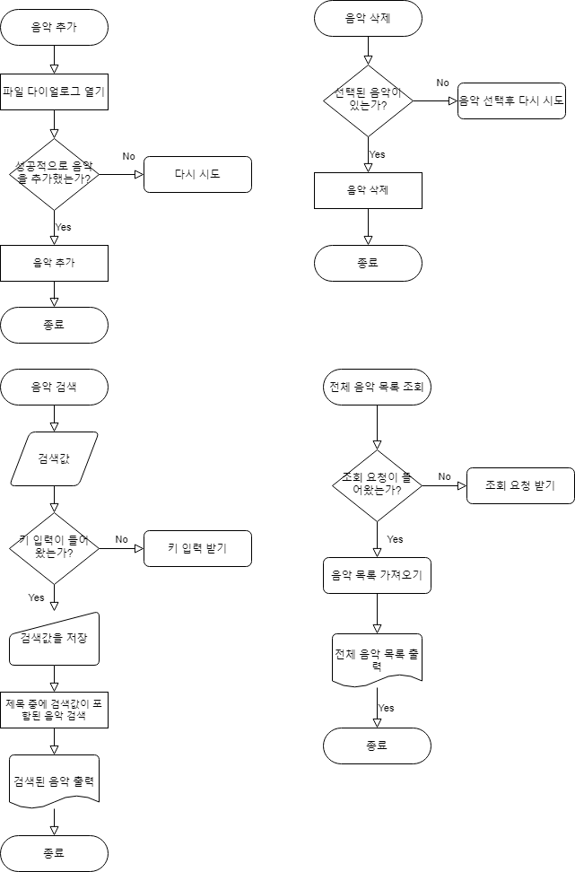

# 음악플레이어 기획

### 요구사항

1. 미디어 관련
   1. 음악 재생
   2. 음악 정지
   3. 음량 조절
   4. 재생 중인 음악 정보 표시
   5. 재생 위치 표시
   6. 재생 위치 선택 시 해당 위치부터 재생
2. 목록 관리
   1. 음악 추가
   2. 음악 삭제
   3. 음악 검색
   4. 전체 음악목록 조회

### 구조 설계

- 플로우차트

- 클래스 다이어그램

### 인터페이스 설계

### 출처

인터페이스 아이콘:  <a href="https://www.flaticon.com/" title="Flaticon"> www.flaticon.com (<a href="https://www.flaticon.com/authors/bqlqn" title="bqlqn">bqlqn</a>), <a href="https://www.flaticon.com/" title="Flaticon"> www.flaticon.com  (<a href="https://www.flaticon.com/authors/roundicons" title="Roundicons">Roundicons</a>)  </a></a>